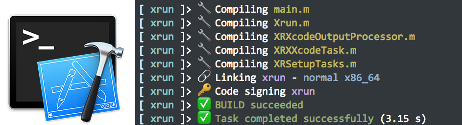

Xrun
====

  

About
-----

### Xrun is a drop-in replacement for Apple's xcodebuild or Facebook's xctool

 - **Fully compatible with `xcodebuild`**
 - **Designed to work with CI environment, like [Travis](http://travis-ci.org)**
 - **Human-friendly, colored output**
 - **Compatible with latest Xcode versions**

Installation
------------

> **Note: Xrun is currently in development, and no release have been published yet.**

Xrun can be easily installed with [Homebrew](http://brew.sh):

    brew install macmade/tap/xrun

Basic examples
--------------

    xrun clean build
    
Cleans the build directory and builds the first target in the Xcode project in the directory from which xrun was started.

    xrun -project Foo.xcodeproj -scheme Bar analyze test
    
Analyses and tests the scheme `Bar` of the `Foo.xcodeproj` project.

Example Travis configuration
----------------------------

    language: objective-c
    install:
    - brew install macmade/tap/xrun
    - xrun setup
    script:
    - xrun build analyse test 

Compatibility with `xcodebuild`
-------------------------------

Xrun is fully compatible with `xcodebuild`, and can be used with the same command line options:

    xrun install DSTROOT=/ -alltargets

Usage
-----

    Usage: xrun [-project <project>] [[-scheme <scheme>]...] [<action>]...
    
    Available actions:
    
        build                   Build the target in the build root (SYMROOT).
                                This is the default action, and is used if no
                                action is given.
        
        build-for-testing       Build the target and associated tests in the
                                build root (SYMROOT).
                                This will also produce an xctestrun file in the
                                build root.
                                This requires specifying a scheme.
        
        analyze                 Build and analyze a target or scheme from the
                                build root (SYMROOT).
                                This requires specifying a scheme.
        
        archive                 Archive a scheme from the build root (SYMROOT). 
                                This requires specifying a scheme.
        
        test                    Test a scheme from the build root (SYMROOT).
                                This requires specifying a scheme and optionally
                                a destination.
        
        test-without-building   Test compiled bundles. If a scheme is provided
                                with -scheme then the command finds bundles in
                                the build root (SRCROOT).
                                If an xctestrun file is provided with -xctestrun
                                then the command finds bundles at paths
                                specified in the xctestrun file.
        
        install-src             Copy the source of the project to the source
                                root (SRCROOT).
        
        install                 Build the target and install it into the
                                target's installation directory in the
                                distribution root (DSTROOT).
        
        clean                   Remove build products and intermediate files
                                from the build root (SYMROOT).
        
        setup                   Performs initial setup and install additional
                                dependancies.
        
        coverage                Uploads code coverage data, if available,
                                to coveralls.io.
    
    Options:
        
        -help       Displays the command usage.
        -version    Displays the Xrun version.
        -license    Displays the Xrun license.
        -verbose    Enables verbose mode.
        -project    Specifies the Xcode project.
        -scheme     Specifies the Xcode scheme.
                    This argument may be supplied multiple times.
        -no-prompt  Disables prompt hierarchy.

License
-------

Xrun is released under the terms of the MIT license.

Repository Infos
----------------

    Owner:          Jean-David Gadina - XS-Labs
    Web:            www.xs-labs.com
    Blog:           www.noxeos.com
    Twitter:        @macmade
    GitHub:         github.com/macmade
    LinkedIn:       ch.linkedin.com/in/macmade/
    StackOverflow:  stackoverflow.com/users/182676/macmade
